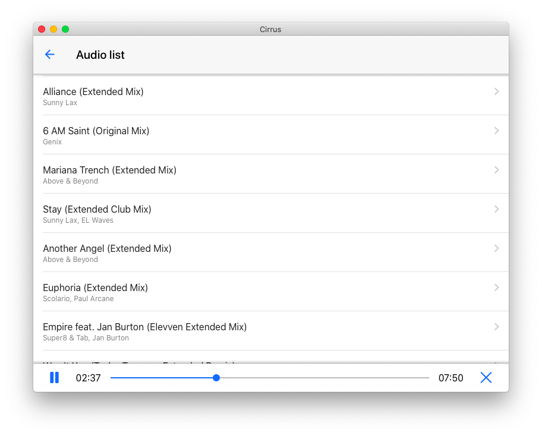
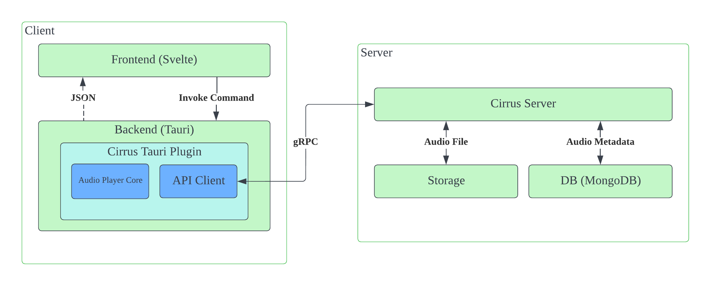

# Cirrus

Cirrus is an open source audio streaming service.

This repository contains:

* cirrus-app: desktop application that plays audio
* cirrus-server: manage audio library and serve audio data

At now, supported audio format is restricted as `AIFF` and `16-bit, 2-channel`.

## Quickstart

### Server

**Warning: Cirrus will create and write documents to MongoDB server under `cirrus` collection**

* Requirements
  * MongoDB
* Build Cirrus server with `cargo build --release` under `cirrus-server` directory
* Configuration
  * Copy the `configs` directory from `cirrus-server` to the working directory where you're launch `cirrus-server` (e.g. `cirrus-server/target/release`)
  * Copy configuration file `server.sample.toml` to `server.toml` at `configs/cirrus`, and set your configuration values in `server.toml` 
* Run Cirrus server with `cargo run --release`
* Add your musics to Cirrus
  * At now, gRPC client (e.g. BloomRPC) is required to request audio management actions. You can import proto file that defines API in Cirrus (located at `protobuf/cirrus.proto`)
  * Add audio directory with `cirrus.AudioLibrarySvc/AddAudioLibrary`
  * Read ID3 tags in audio file with `cirrus.AudioLibrarySvc/AnalyzeAudioLibrary`

### Client

* Configuration
  * Copy `client.sample.toml` to `client.toml` at `cirrus-app/src-tauri/resources/configs/cirrus`
  * Set your configuration values in `client.toml` 
* Move to `cirrus-app` directory
* Install dependencies by run `yarn`
* Build and run client
  * Debug build: run `yarn tauri dev`
  * Release build:
    * Build client by run `yarn tauri build`
    * Run client located at `src-tauri/target/release/`

## Architecture

### Overview

### Project Strucutre

* cirrus-app: Cirrus client frontend that provides UI and interact backend with Tauri plugin
* cirrus-server: manages audio metadata and serves audio data
* crates
  * aiff-rs: read idv3 tags and audio data from AIFF audio file
  * cirrus-client-core: implementation of core audio player
  * cirrus-protobuf: contains protobuf definition and provide interoperability with Rust
  * cirrus-tauri-plugin: Tauri plugin that initialize and utilize core audio player
* protobuf: Cirrus protobuf files

### Stack

* Client
  * Svelte: UI
  * Tauri: desktop application framework
  * cpal: low-level library for audio output
* Server
  * MongoDB: data source of audio metadata and audio library
  * aiff-rs: AIFF audio file reader
* Common
  * tonic: gRPC framework

## Q&A

### How is the audio player composed?

An audio player is composed of user interface and Cirrus audio core library (CACL). An UI interacts with CACL by register Cirrus Tauri plugin (CTP), which has an audio player interface and interactable via Tauri command to Tauri application for integrate on it. The CTP does initialize audio player instance from CACL and store this one within the Tauri State.

And an audio core library implements audio play that initializes audio output device, play audio from data (sample) and fetch audio data and fill to audio playback buffer. 

For example, if user clicks audio item from UI to play, UI (frontend) invokes audio load command (`plugin:cirrus|load_audio`) and plugin handles dispatched command by calling audio player instance's load audio method.

### How audio player plays audio?

An client creates audio playback object (`cpal::Stream`) with configuration (e.g. sample rate) and calls `play` method that run audio output thread. An audio play process is take audio samples from audio data buffer and give them to mutable array to output an audio, and is registered as audio play callback at stream creation.

And an audio buffer is filled by audio buffer thread that fetch data, process and fill to audio buffer queue. The audio data is part of PCM from audio file and is responsed from server as `u8` array. To read audio data, pre-process is required. As a case of the 16-bit audio, read as a step size 2 for each, convert to `i16` and divide by sample rate.

### How server reads and manages audio files?

In most cases, an audio directory has sub-directories that contain audio files. And Cirrus reads audio files from audio directories. Cirrus thinks that there is root (`library-root`) of sub-directories and sub-directory contains metadata of audio contents (`library`) such as timestamp of directory that used for check modification of directory at library refresh. An audio file metadata (`audio`) has field filename and path of audio sub-directory to point the actual path of audio file, and timestamp for check update of this one. And audio has tags such as title, artist, genre and so on. This information is stored at (`audio-tags`) collection.

A Cirrus server manages audio libraries with these behaviors:

* `add_audio_library`: insert `library-root` and `library` document to database
* `remove_audio_library`: remove documents of audio `library-root`, `library` and related audio data (`audio`) from database
* `analyze_audio_library`: create `audio-tags` document from `audio` and insert to database
* `refesh_audio_library`: update `library`, `audio`, `audio-tags` documents.

## License

This project is licensed under the terms of the MIT license.
